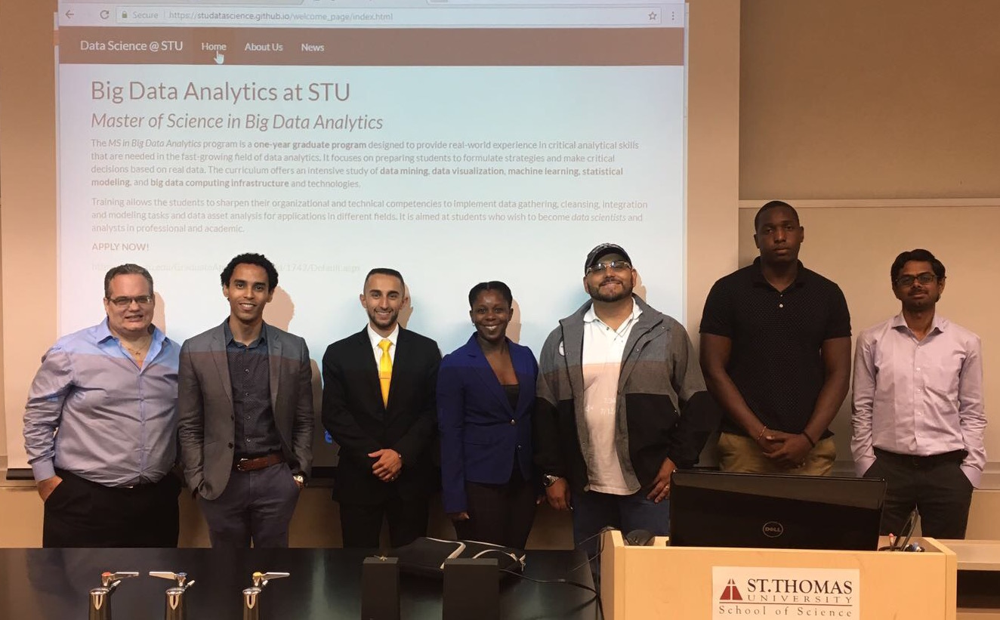

## Summer 2017

- Students from the MS in Big Data Analytics finished their **Capstone Projects** this Summer! Congratulations to all!

```{r, out.width = "600px", fig.align='center', echo=FALSE}

```

```{r, fig.show = 'hold', out.width = '50%', echo=FALSE}
knitr::include_graphics(c("vynneBDA.jpg","su17grad.JPG") )
```

- Miami Dade College (MDC) and St Thomas University (STU) students participating on the **Summer Research Institute (SRI) 2017** continue to learn about data science and are using `R` for cool undergraduate projects. 


- **CIS 204 Intro to Data Sience** to be offered during the Fall of 2017. _Enroll now!_

    (i) Instructor: [Reinaldo Sanchez-Arias, PhD](https://www.stu.edu/science/faculty-staff/Reinaldo-Sanchez-Arias)
  
    (ii) Meetings: MW 1:40 - 2:55 PM CCL 101

## Fall 2017

- MDC Students, Sabrina Romero and Jose Muguira, presented their data science projects during the MDC STEM Symposium in September 2017.


```{r, fig.show = 'hold', out.width = '50%', echo=FALSE}
knitr::include_graphics(c("JosePoster.JPG","SabrinaPoster.JPG") )
```


- Biology students Claudia Gorbea and Amanda Lobato, who worked with Dr. [Pilar Maul](https://www.stu.edu/science/faculty-staff/Pilar-Maul) and Dr. Sanchez-Arias as well as faculty from Nova Oceanographic Center, will present their project _"Analysis of Microbial Communities Reflect Vertical Migration in the Gulf of Mexico"_ at the 2017 American Society for Microbiology - Florida Branch Meeting in Clearwater Beach, FL. 
A variety of data analysis `R` tools were used during this project for data visualization!

- Dr. Sanchez-Arias participated in the STU Biology Seminar Series, with a presentation on _Big Data Analytics in Life Sciences_. The seminar is organized by [Dr. Jeff Plunkett](https://www.stu.edu/science/Faculty-Staff/Jeffrey-Plunkett), with participation of STU faculty, as well as of students in the [MS in Cell and Molecular Biology](https://www.stu.edu/science/Programs/MS-Cell-and-Molecular-Biology) 

- Dr. [Sanchez-Arias](https://www.stu.edu/science/faculty-staff/Reinaldo-Sanchez-Arias) was recently invited to participate in the [FIU Biomedical Engineering Wallace H. Coulter Foundation Lecture Series](https://bme.fiu.edu/resources/lecture-series/), with a seminar talk on _"Data Analytics and Machine Learning Applications for Engineering and Science"_. 

- Dr. [David Quesada](https://www.stu.edu/science/Faculty-Staff/David-Quesada) participated in the [Geological Society of America (GSA) Annual Meeting](https://gsa.confex.com/gsa/2017AM/webprogram/Paper301341.html), presenting about his work on how to enhance _climate literacy_ across liberal arts education through cross-curriculum embedding of topics. He presented a summary of 4 years of partnership with the American Meteorological Society and the GSA educational initiatives.
